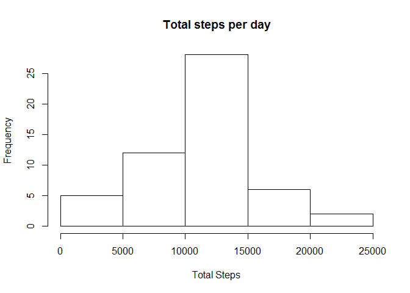
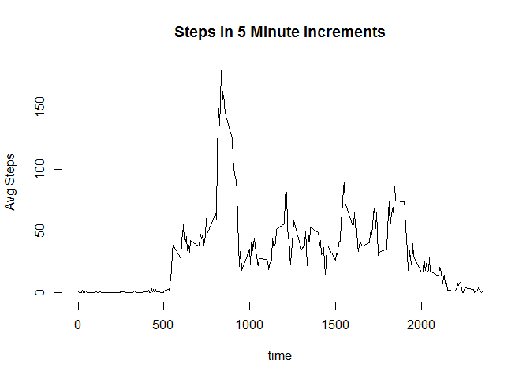
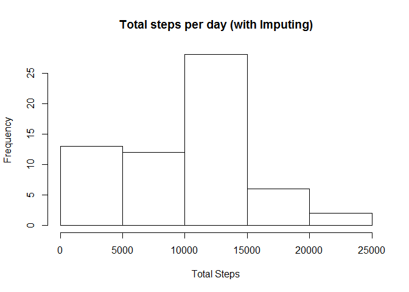

# Reproducible Research: Peer Assessment 1


## Loading and preprocessing the data

```r
#read in data file
  data1 <- read.csv("./activity.csv")
```


## What is mean total number of steps taken per day?

```r
#Summarize Steps by Date to a dataset called 't'
t <- aggregate(steps ~ date, data=data1, FUN=sum)

#Create histogram
#Histogram of steps taken
hist(t$steps,xlab = "Total Steps", main = "Total steps per day")
```

 

Calculate the mean and median steps taken per day

```r
##Summary Stats steps
mean(t$steps)
```

```
## [1] 10766.19
```

```r
median(t$steps)
```

```
## [1] 10765
```


## What is the average daily activity pattern?

```r
#Summarize Steps by Date & Interval
t2 <- aggregate(steps ~ interval, data=data1, FUN=sum)

#count number of days in data source
uniq<- length(unique(data1$date))
#61 days

#create new variable with average steps
t2$avgsteps <- t2$steps/uniq


plot(t2$interval, t2$avgsteps, type="l",
     ylab="Avg Steps", xlab="time",
     main = "Steps in 5 Minute Increments")
```

 


Calculate time increment with maximum avg steps


```r
t2[which.max(t2$avgsteps),] 
```

```
##     interval steps avgsteps
## 104      835 10927 179.1311
```

```r
#835
```

The maximum occurs at interval 835

## Imputing missing values

Determine number of missing values

```r
summary(data1)
```

```
##      steps                date          interval     
##  Min.   :  0.00   2012-10-01:  288   Min.   :   0.0  
##  1st Qu.:  0.00   2012-10-02:  288   1st Qu.: 588.8  
##  Median :  0.00   2012-10-03:  288   Median :1177.5  
##  Mean   : 37.38   2012-10-04:  288   Mean   :1177.5  
##  3rd Qu.: 12.00   2012-10-05:  288   3rd Qu.:1766.2  
##  Max.   :806.00   2012-10-06:  288   Max.   :2355.0  
##  NA's   :2304     (Other)   :15840
```

2,304 records with NA

####Impute missing data (NA) with the median values of steps at that specific interval

```r
#compute median step time for imputing
step_med <- aggregate(steps ~ interval, data=data1, FUN=median)

#change colnames
colnames(step_med) <- c("interval","med_steps")


library("plyr")
library("dplyr")
```

```
## 
## Attaching package: 'dplyr'
## 
## The following objects are masked from 'package:plyr':
## 
##     arrange, count, desc, failwith, id, mutate, rename, summarise,
##     summarize
## 
## The following object is masked from 'package:stats':
## 
##     filter
## 
## The following objects are masked from 'package:base':
## 
##     intersect, setdiff, setequal, union
```

```r
#Append median time by merging based on interval
Joindata<-arrange(join(data1,step_med),interval)
```

```
## Joining by: interval
```

```r
Joindata$steps[is.na(Joindata$steps)] <- Joindata$med_steps[is.na(Joindata$steps)]
#remove column with median steps for imputing
Joindata$med_steps <- NULL

#Summarize Steps by Date
Joindata_t <- aggregate(steps ~ date, data=Joindata, FUN=sum)
```
####Create histogram

```r
##Histogram of steps taken
hist(Joindata_t$steps,xlab = "Total Steps", main = "Total steps per day (with Imputing)")
```

 

```r
mean(Joindata_t$steps)
```

```
## [1] 9503.869
```

```r
median(Joindata_t$steps)
```

```
## [1] 10395
```

After imputing the missing values, the mean and median shift down compared to before.
## Are there differences in activity patterns between weekdays and weekends?


```r
# convert date to class 
Joindata$date <- as.Date(Joindata$date)

# add a new column containing day of week
Joindata$weekday = weekdays(Joindata$date)

# factor containing either Weekday OR Weekend
Joindata$weekday_class <- ifelse(Joindata$weekday == "Saturday" | Joindata$weekday == 
                                 "Sunday", "Weekend", "Weekday")
# convert column to factor
Joindata$weekday_class <- factor(Joindata$weekday_class)

#compute median step time for imputing
step_wkd <- aggregate(steps ~ interval + weekday_class, data=Joindata, FUN=mean)


library(lattice)

xyplot(steps ~ interval | weekday_class, data = step_wkd, layout = c(1, 2), type = "l", 
       ylab = "Avg number of steps", 
       main = "Avg number of steps by Day Type")
```

 

```r
#The chart shows that the weekdays have one large spike of steps while the weekend has multiple spikes throughout the day.
```

